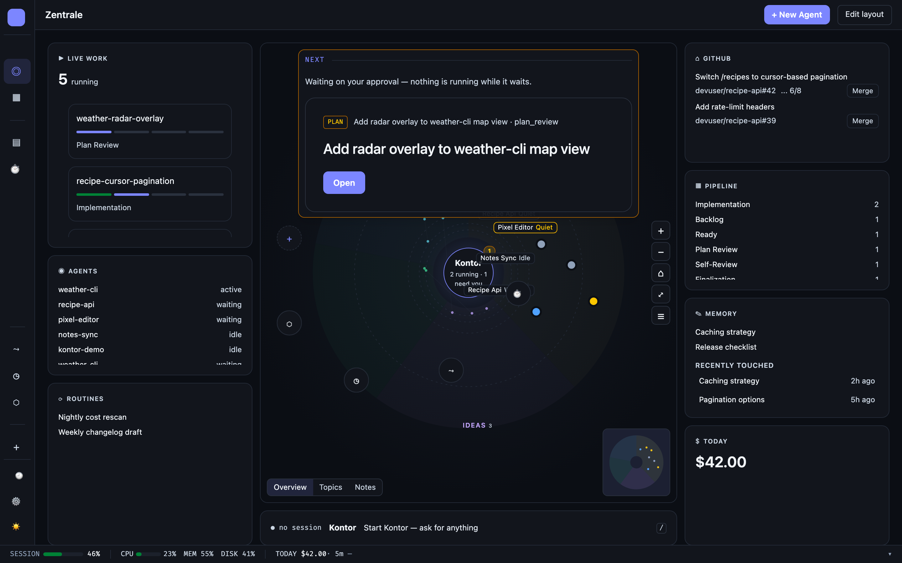
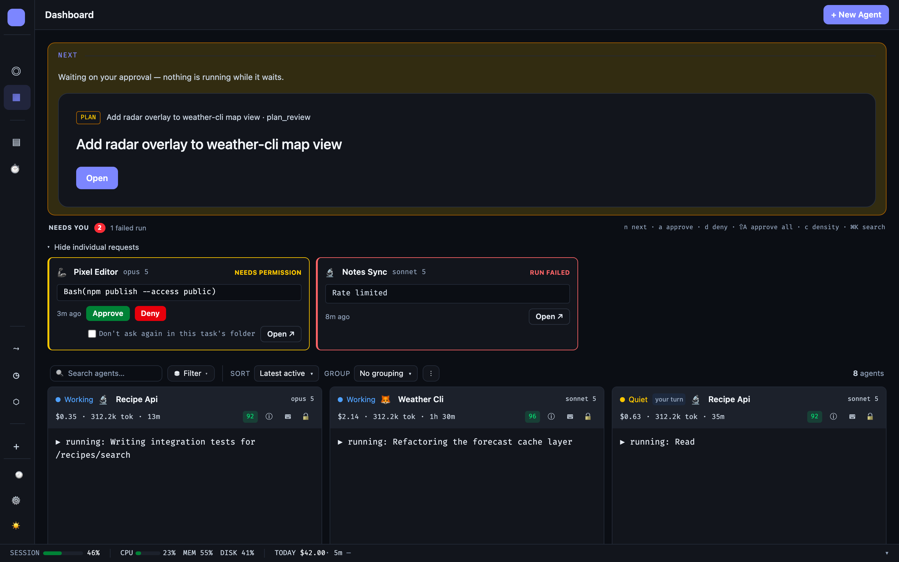
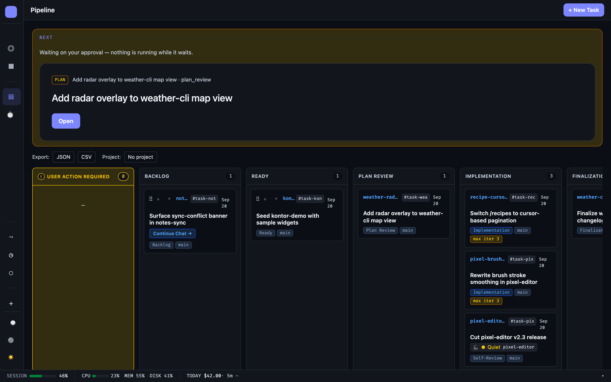
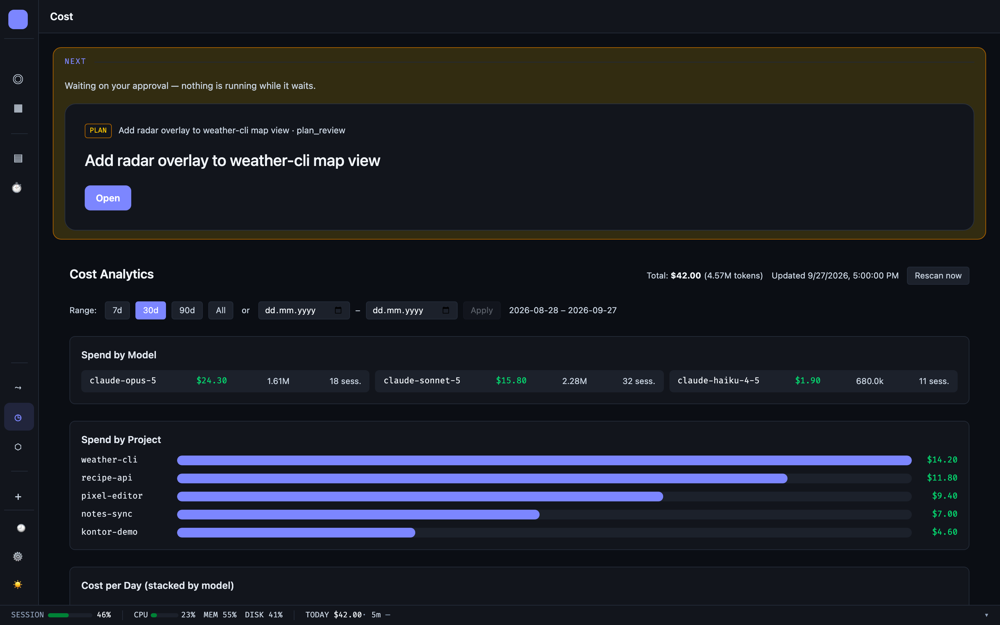
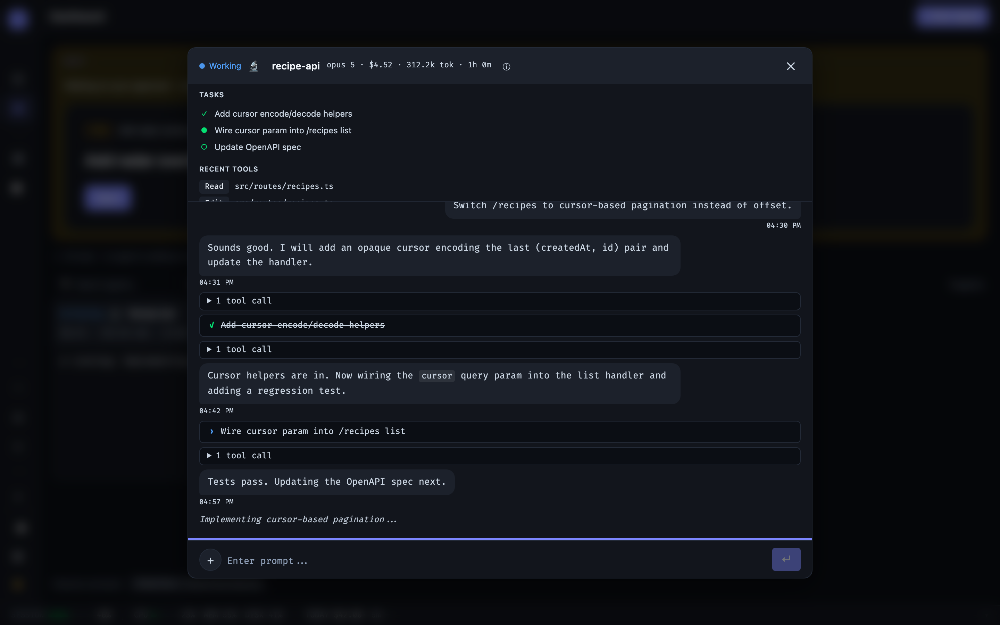

<div align="center">

# Kontor

**A real-time monitoring and control plane for locally running Claude Code agents.**

[](https://github.com/lx-wnk/kontor/actions/workflows/ci.yml)
[](https://github.com/lx-wnk/kontor/releases)
[](./LICENSE)
[](https://go.dev/)
[](https://vuejs.org/)
[](https://pnpm.io/)

</div>

**Kontor** — a Hanseatic merchants' word for the counting house from which a trading office ran its business. Here: the browser window from which you monitor and steer your agents.

<p align="center">
  
</p>

## Why Kontor

Most agent monitors require hooks or wrappers in every project. This one doesn't — it reads what Claude Code already writes to disk and watches the processes you already run.

- 🔌 **Zero-config monitoring** — scans processes and reads `CLAUDE_CONFIG_DIR` to discover agents; no per-project setup
- 🔁 **Task pipeline** — a state machine that spawns isolated git worktrees and runs multi-stage tasks
- 🎛️ **MCP control plane** — authenticate agents and grant scoped permissions from the dashboard
- 🔐 **Auth & permissions** — GitHub OAuth + JWT, scoped API keys, and a capability gate (see [Security](docs/guides/security.md) for detail)
- 🏠 **Local-first** — binds to `127.0.0.1`, no telemetry, no SaaS

## Quickstart

**Prerequisite:** [Claude Code](https://claude.ai/code) installed and run at least once. macOS and Linux only.

### Install

```sh
curl -fsSL https://raw.githubusercontent.com/lx-wnk/kontor/main/install.sh | sh
```

Or Homebrew (macOS):
```sh
brew install lx-wnk/tap/kontor
```

### First run

```sh
kontor serve
```

Open **http://127.0.0.1:13120** — any running Claude Code agents appear automatically.

For Docker, manual binary download, and all options, see [Install guide](docs/guides/install.md).

### Develop from source

Requires Go 1.26+, [Task](https://taskfile.dev), [air](https://github.com/air-verse/air), Node.js 22+, and [pnpm](https://pnpm.io/).

```bash
git clone https://github.com/lx-wnk/kontor.git
cd kontor
pnpm install
task dev            # hot-reload on :13120
```

See [CONTRIBUTING.md](./CONTRIBUTING.md) for the full dev setup and command reference.

## Screenshots

| | |
|---|---|
|  |  |
| Dashboard — live agent roster with the needs-you band | Pipeline — tasks across stages, each in its own worktree |
|  |  |
| Cost insights — token usage and spend by session | Agent detail — transcript, tasks, and permissions |

*Images generated from demo data. Regenerate with `pnpm screenshots`.*

## Features

**Zentrale & hub** — the default view: what needs you in the centre, live work, GitHub, pipeline, memory and today's cost around it. Every tile can be moved, resized, added or removed with **Edit layout**. The centre tile is a zoomable map of running agents and your Obsidian vault's notes on the same coordinate system. Notes are placed by your vault's folder hierarchy: each first-level folder is a category circle around the core, each second-level folder a project circle inside it, and every note sits in its project's circle, all sized in proportion to what they hold; older notes are drawn fainter. Agents sit on the rim of their project's circle. The hub renders three semantic levels (Overview shows the circles; Topics labels every project and draws know-how links inside it; Notes labels notes and draws every link); each level switches at a zoom threshold. Notes display their kind (frontmatter `type`, folder path, or `note` by default). Agents without a matching vault folder fold into a `+N other` badge. Press `?` for a legend; the Unlinked / Stale toggle (also in the Memory tile) highlights know-how notes that nothing links to or that have not been touched for 90+ days.

**Kontor session** — one Claude session per installation that can read and steer Kontor through its task API; start it from the Zentrale or the `Cmd+K` field.

**Dashboard** — real-time agent roster over SSE (list, card, kanban) with tokens, cost, status and uptime; a needs-you band that approves or denies permission prompts in bulk; chat-style transcripts with tool groups and subagent badges; `Cmd+K` spotlight search.

**Live sessions** — agents spawned from the dashboard run interactively via tmux or a built-in pty broker; the agent modal has a real terminal tab and answers `AskUserQuestion` prompts inline.

**Pipeline & schedules** — tasks move through backlog, optional plan review, implementation, self-review and finalization, each stage a `claude` process in its own git worktree behind permission gates; per-stage engine, model and reasoning effort. Schedules fire recurring tasks from a cron expression (written in plain language, translated once).

**Insights** — workflow patterns, cost by project and session, and eval drift detection over past stage runs.

**Integrations** — MCP endpoint with scoped tokens, Obsidian vault ([guide](docs/guides/obsidian.md)), GitHub pull requests ([guide](docs/guides/github.md)), pluggable LLM adapters (OpenAI-compatible, Ollama, `anthropic`), Web Push, webhook and email notifications. Codex, Gemini and Junie CLI agents can be monitored opt-in.

**Security & permissions** — GitHub OAuth + JWT, scoped API keys, and one capability gate (allow / deny / ask) for spawned agents, memory, Obsidian and GitHub access. See [Security](docs/guides/security.md).

The full reference lives in [`docs/`](docs/README.md).

## How it works

Kontor scans the processes you already run (`ps`/`lsof`) and reads the `CLAUDE_CONFIG_DIR` each one reports, discovering Claude Code sessions on disk. It tail-reads their `.jsonl` session logs, merges them with process metadata (PID, status, token cost), and broadcasts live updates to your browser over SSE. Agents answer back through an authenticated MCP endpoint that gates every tool by permission — GitHub OAuth for the dashboard, scoped bearer tokens for spawned agents — and you steer multi-stage tasks through git worktrees, capture memory, and answer permission prompts from the dashboard instead of their terminals.

See [Architecture overview](docs/architecture/overview.md) for the full stack, package layout, and data flow.

## Documentation

| | |
|---|---|
| [Install](docs/guides/install.md) | Download, Homebrew, Docker, build from source |
| [Configuration](docs/guides/configuration.md) | Every environment variable |
| [MCP endpoint](docs/guides/mcp.md) | Scopes, tools, connecting Claude |
| [Agent control](docs/guides/agent-control.md) | Channel control, spawn dialog, permissions |
| [Security](docs/guides/security.md) | Threat model, auth hardening, capability gate |
| [Desktop app](docs/guides/desktop.md) | macOS native shell |
| [Troubleshooting](docs/guides/troubleshooting.md) | Restart, locked out, common issues |
| [Obsidian vault](docs/guides/obsidian.md) | Local REST API setup and indexing |
| [GitHub integration](docs/guides/github.md) | Token, repository allow-list, merge from dashboard |
| [Architecture](docs/architecture/overview.md) | Stack, packages, data flow, pipeline |
| [Shell statusline](docs/guides/statusline.md) | PS1 integration |
| [Agent skills](docs/guides/agent-skills.md) | Registry-owned skills |

Full index: [`docs/`](docs/README.md).

## Contributing

Contributions welcome. See [CONTRIBUTING.md](./CONTRIBUTING.md) for setup, commands, and PR process.

## Security

See [SECURITY.md](./SECURITY.md) for hardening, defaults, and the threat model.

## License

[MIT](./LICENSE) © Alexander Wink
